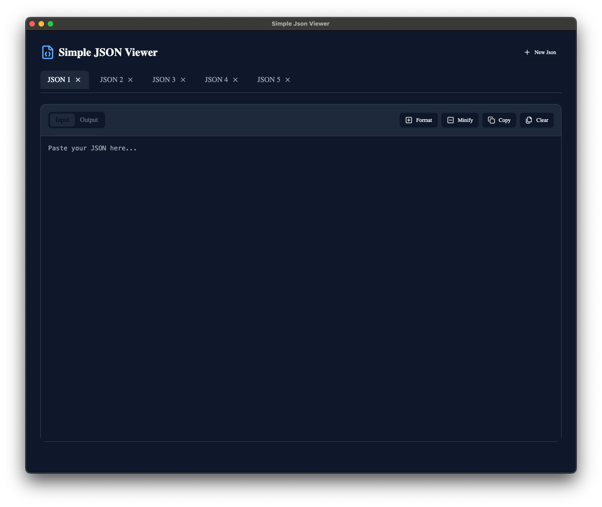

# Modern JSON Viewer

A clean and modern desktop application for viewing, formatting, and manipulating JSON data. Built with Electron, React, and TypeScript.



## Features

- 🎨 Clean, modern interface
- 📝 Multiple tabs support
- 🔄 Format and minify JSON
- 📋 Copy formatted JSON to clipboard
- 🌙 Dark mode by default
- 💻 Cross-platform (Windows, macOS, Linux)

## Development

### Prerequisites

- Node.js (v18 or higher)
- npm (v9 or higher)

### Installation

1. Clone the repository
```bash
git clone https://github.com/groobybugs/json-viewer.git
cd json-viewer
```

2. Install dependencies
```bash
npm install
```

3. Start the development server
```bash
npm run electron:dev
```

### Building

To create a production build for your current platform:

```bash
npm run electron:build
```

The built application will be available in the `release` directory.

## Project Structure

```
json-viewer/
├── src/                   # Source code
│   ├── components/        # UI components
│   └── lib/              # Utilities and helpers
├── electron/              # Electron main process
└── dist/                  # Built files
```

## Technology Stack

- [Electron](https://www.electronjs.org/) - Cross-platform desktop framework
- [React](https://reactjs.org/) - UI framework
- [TypeScript](https://www.typescriptlang.org/) - Type safety
- [Vite](https://vitejs.dev/) - Build tool
- [Tailwind CSS](https://tailwindcss.com/) - Styling
- [Radix UI](https://www.radix-ui.com/) - UI primitives
- [Lucide Icons](https://lucide.dev/) - Icons

## Scripts

- `npm run electron:dev` - Start the development server
- `npm run electron:build` - Create a production build
- `npm run lint` - Run ESLint
- `npm run build` - Build the application without packaging
- `npm run preview` - Preview the built application

## Contributing

1. Fork the repository
2. Create your feature branch (`git checkout -b feature/AmazingFeature`)
3. Commit your changes (`git commit -m 'Add some AmazingFeature'`)
4. Push to the branch (`git push origin feature/AmazingFeature`)
5. Open a Pull Request

## License

This project is licensed under the MIT License - see the [LICENSE](LICENSE) file for details.

## Acknowledgments

- Design inspired by modern development tools
- Built using [electron-vite](https://github.com/electron-vite/electron-vite)
- Icons from [Lucide](https://lucide.dev/)
